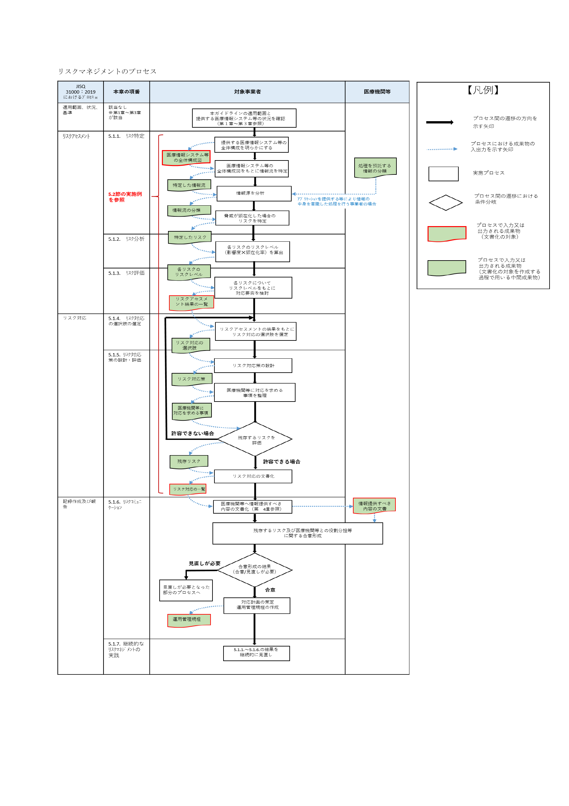

# 経済産業省

「医療情報を取り扱う情報システム・サービスの提供事業者における安全管理ガイドライン」
<https://www.meti.go.jp/policy/mono_info_service/healthcare/teikyoujigyousyagl.html>

## 医療情報システムにおけるリスクベースセキュリティ設計のための読書メモ

- [経済産業省](#経済産業省)
  - [医療情報システムにおけるリスクベースセキュリティ設計のための読書メモ](#医療情報システムにおけるリスクベースセキュリティ設計のための読書メモ)
    - [ガイドライン策定方針](#ガイドライン策定方針)
    - [ガイドライン対象者](#ガイドライン対象者)
    - [義務と責任の考え方](#義務と責任の考え方)
      - [善管注意義務と守秘義務の適用](#善管注意義務と守秘義務の適用)
      - [個人情報保護法の適用](#個人情報保護法の適用)
    - [情報提供と合意形成](#情報提供と合意形成)
      - [1. 事業者の選定基準として少なくとも確認する必要がある項目](#1-事業者の選定基準として少なくとも確認する必要がある項目)
      - [2. 医療機関等との共通理解を形成するために情報提供すべき項目](#2-医療機関等との共通理解を形成するために情報提供すべき項目)
    - [リスク管理プロセス](#リスク管理プロセス)
      - [リスクアセスメントの実施手順（5.2.1）](#リスクアセスメントの実施手順521)
      - [リスク特定](#リスク特定)
      - [リスク分析](#リスク分析)
      - [リスク評価](#リスク評価)
      - [リスク対応の選択肢の選定](#リスク対応の選択肢の選定)
      - [リスク対応策の設計・評価](#リスク対応策の設計評価)
      - [リスクコミュニケーション](#リスクコミュニケーション)
    - [リスクアセスメントの実施例（5.2.1）](#リスクアセスメントの実施例521)
      - [(1) 全体構成図の作成](#1-全体構成図の作成)
      - [(2) 情報流の特定](#2-情報流の特定)
    - [制度上の必須要件](#制度上の必須要件)
    - [用語](#用語)

### ガイドライン策定方針

- 医療情報システムは、一律のルールじゃなくて特性に合わせたリスクベースで考える
- セキュリティ対策の妥当性や限界は、ちゃんと説明する前提
- 関係者と共通理解を作って、明示的に合意した上で運用する
  - そのために、リスクコミュニケーションをちゃんとやる

### ガイドライン対象者

医療情報を扱うシステムやサービスに少しでも関わる事業者は、基本的に全部対象。

### 義務と責任の考え方

#### 善管注意義務と守秘義務の適用

対象事業者は、医療機関等と契約して医療情報システム等を提供する以上、
契約形態（準委任・請負など）にかかわらず、少なくとも次を負う。

- 医療機関等に対する善管注意義務
- 契約上の守秘義務

#### 個人情報保護法の適用

事業者が医療機関から個人情報（医療情報）の取扱いを委託される場合、
委託先である当該事業者にも個人情報保護法が適用される。

一方で医療機関は委託元として、委託先における個人データの安全管理が図られるよう
監督義務を負う。観点は次の三点。

- ①適切な委託先の選定
- ②委託契約の締結
- ③委託先における個人データ取扱状況の把握

医療機関は委託元として「監督責任」を負う立場にあるが、
医療やIT・セキュリティの専門家ではないことが前提になっている。
だからこそ、対象事業者の側が、セキュリティの専門家として、
医療機関が判断できる形で説明し、リスクを示し、理解と合意を得るところまで責任を負う。

**共通理解の形成**

- 契約書や SLA とは別に、共通理解を形成することが重要
- 共通理解の対象
  - 責任分界
  - 非常時（事故・障害時）の対応
  - システムの機能・性能・仕様
- 共通理解を行った証跡として、議事録や作業メモを作成・保存する

**通常時の義務**

- **開発フェーズ**
  - 新規開発だけでなく、機器・端末のアップデートや機能更新に伴う保守開発、運用前の初期設定までを含む
  - 運用フェーズから再度開発フェーズに移行する場合や、運用中に開発フェーズが並行して発生する場合もある
- **運用フェーズ**
  - 医療情報システム等の運用を行うフェーズ
  - 運用状況および実施しているセキュリティ対策について、定期的に報告し、あわせてセキュリティ対策の自己点検を行い、その結果を必要に応じて医療機関へ報告する。
- **契約終了フェーズ**
  - 契約終了時に、事前に合意した手順に従って情報（プログラム等を含む）の返却・移管・破棄を行う
  - 適切に実施したことを示す証跡を取得・保存する

**危機管理対応時**

- CIA（機密性・完全性・可用性）のいずれかが害された、または害されるおそれが生じ、対応が必要になった状態
  - 影響範囲・原因等について、**説明可能な情報を速やかに開示する**
  - 事故の拡大を防ぐため、**即時の封じ込め・復旧対応を行う**
  - **再発防止策を整理し、医療機関と合意の上で実施する**

### 情報提供と合意形成

事業者が医療機関等と合意形成するために必要な医療機関等へ情報提供すべき項目

#### 1. 事業者の選定基準として少なくとも確認する必要がある項目

| 項目 |
| --- |
| 保存された医療情報を格納する情報機器等が、国内法の適用を受けることを確認すること |
| 医療情報を保存する情報機器等が設置されている場所（地域、国） |
| 受託事業者に対する国外法の適用可能性 |
| 医療情報等の安全管理に係る基本方針・取扱規程等の整備状況 |
| 不正ソフトウェア等のサイバー攻撃による被害を防止するために必要なバックアップの取得及び管理の状況 |
| 医療情報等の安全管理に係る実施体制の整備状況 |
| 実績等に基づく個人データ安全管理に関する信用度 |
| 財務諸表等に基づく経営の健全性 |
| プライバシーマーク認定又は ISMS 認証を取得していること |

> **医療情報を扱う以上、事業者はプライバシーマークかISMS等の第三者認証を取得し、医療機関に対して最低限の適格性を示せ**

**信用度についての補足**

医療機関側が確認したいのは、例えば以下のような点：

- 過去に重大な情報漏えい事故を起こしていないか
- 事故があった場合
  - 隠さず報告したか
  - 再発防止までやり切ったか
- 医療・個人情報を扱う業務実績がどれくらいあるか
- 監査・第三者評価で是正勧告を放置していないか
- 長期間サービスを提供してきた中で運用が破綻していないか

**認証についての補足（Pマーク・ISMSを取得していない場合）**

以下のいずれかの認証等により、適切な外部保存に求められる技術又は医療情報システム等の適切な運用管理能力の有無を確認すること：

- 政府情報システムのためのセキュリティ評価制度（ISMAP）（ISMAP-LIU は含まない）
- 米国 FedRAMP（LI-SaaS は含まない）
- AICPA SOC2（日本公認会計士協会 IT7号）
- AICPA SOC3（SysTrust/WebTrust）（日本公認会計士協会 IT2 号）

上記認証等が確認できない場合、以下のいずれかの資格を有する者による外部監査結果により、同等の能力の有無を確認すること：

- システム監査技術者
- Certified Information Systems Auditor（ISACA 認定）
- 「民間事業者による医療情報に係るクラウドサービスの評価」（一般社団法人保健医療福祉情報安全管理適合性評価協会）

#### 2. 医療機関等との共通理解を形成するために情報提供すべき項目

| カテゴリ | 情報提供すべき項目 |
| --- | --- |
| **医療機関等との役割分担の明確化**（4.2 参照） | 医療機関等の運用管理規程に定める必要がある事項 |

> ※システムが堅牢でも医療機関側の運用が不適切なら安全は保てない。保守契約がない機器は医療機関等に管理責任がある。事業者は医療機関等の運用を踏まえた役割分担を定め、対応を求める内容も明示すること

| カテゴリ | 情報提供すべき項目 |
| --- | --- |
| **医療情報システム等の安全管理に係る評価**（4.3 参照） | 医療情報システム等の安全管理に係る評価の結果 |

> ※担当者自身の評価は信頼性・客観性が低下するため、独立した監査部門や第三者機関による評価が望ましい

| カテゴリ | 情報提供すべき項目 |
| --- | --- |
| **リスクアセスメントの成果物**（5.1.1、5.2.1 参照） | 医療情報システム等の全体構成図 |
| **リスク対応の成果物**（5.1.5、5.2.2 参照） | リスク対応一覧 |
| **制度上の要求事項への対応の成果物**（第 6 章参照） | 制度上の要求事項への対応 |

**運用管理規程に含める事項**（5.1.6 参照）

- 医療情報システム等の安全管理に係る基本方針
- 医療情報システム等の提供に係る体制
- 契約書・マニュアル等の文書の管理方法
- 機器等を用いる場合の機器等の管理責任の所在・管理方法
- リスク対応策の運用方法
- 事故発生時の対応方法及び医療機関等への報告方法
- 医療情報を格納する記憶媒体等の管理方法
- 医療機関等の危機管理対応時の受託事業者における体制・対応内容
- 医療情報の外部保存に係る患者等への説明方法
- 医療情報システム等に対する監査の実施方針
- 医療機関等の管理者からの問い合わせ窓口

### リスク管理プロセス



> 実施例の詳細は PDF 5.2節（p.41〜53）を参照。以下は手順の要約。

#### リスクアセスメントの実施手順（5.2.1）

1. **全体構成図の作成** — どこにどのような機器・記憶媒体があるかを明らかにする
2. **接続・搬送の明確化** — 機器間のネットワーク接続や記憶媒体の搬送を明らかにし、論理構成の全体像を把握する
3. **人が扱う情報の処理の明確化** — 「誰が」「どこの」「どの機器で」「何を」「どうするか」の切り口で整理する
4. **人が直接扱わない機器における情報の処理の明確化** — サーバやネットワーク機器等について「どこの」「どの機器で」「何が」「どうされるか」で整理する
5. **情報流の特定** — 全体構成図をもとに、提供形態（アプリ／プラットフォーム／インフラ）ごとに、開発・運用・契約終了の各フェーズで情報流を特定する
6. **リスクアセスメント結果一覧の作成** — 情報流に対し、情報流の分類・関連する脅威・脅威の顕在化を想定して特定したリスク・リスクレベルと対応要否を整理する

#### リスク特定

- 医療情報システム等のライフサイクルにおけるフェーズ毎の情報流を特定すること。
  - 情報の作成及び参照、更新、保存、移送、廃棄等の処理を洗い出すと、構成要素間で情報がどのように流れるのかが明らかになる
- 対象の情報の安全管理上の重要度に応じて分類する
  - アプリ事業者（情報の中身を見て処理する系）
    - 医療機関が作った正式な情報分類（患者情報など）を自社の分類の参考にする
  - インフラ／プラットフォーム事業者（情報の中身を見ない処理する系）
    - 最低限以下に分類する
      - 医療情報を含む可能性のある領域
      - それ以外の情報（機器や OS/ミドルウェアの設定情報等）
- 情報流から断面にして一つ一つ脅威を洗い出す。（イメージ1）
  - 医療情報システム等提供上の代表的な脅威を参考にする
    - [ISO/IEC 27005:2022](https://www.iso.org/standard/80585.html)

<details>
<summary>イメージ1</summary>

```yaml
A: Web API
 → B: アプリ内部処理
 → C: DB保存
 → D: ログ出力（CloudWatch）
```

- ① A→B（入力・受付の瞬間）
  - 脅威：なりすまし、不正リクエスト、SQLi
  - 守るもの：機密性・完全性
  - 問われる対策：認証、認可、入力検証
- ② B（アプリ内部）
  - 脅威：権限バグ、内部不正、ロジック欠陥
  - 守るもの：完全性
  - 問われる対策：権限設計、職務分離、レビュー
- ③ B→C（保存）
  - 脅威：不正書き込み、消失、ランサム
  - 守るもの：完全性・可用性
  - 問われる対策：暗号化、バックアップ、IAM
- ④ C→D（ログ）
  - 脅威：ログからの個人情報漏えい
  - 守るもの：機密性
  - 問われる対策：マスキング、アクセス制御

</details>

| 脅威 | 脅威の具体例 |
| --- | --- |
| 不正な閲覧・操作 | 正当な権限を持たない者（組織の内外を問わない）が、医療情報、認証情報等を盗み見る。または、医療情報システム等に関連する端末等を不適切に操作する。 |
| ネットワーク上の盗聴・なりすまし | ネットワーク上を流れるデータの盗聴等により、認証情報等を入手する。または、入手した認証情報等を用いて正当な権限を持つ者になりすます。 |
| 高度サイバー攻撃 | 標的型メール等によって医療情報システム等や関連する端末等をマルウェアに感染させる。 |
| ランサムウェア感染 | 医療情報システム等や関連する端末等をマルウェアに感染させ、PC をロックする、あるいはファイルを暗号化することによって使用不能にしたのち、その復元と引き換えに身代金を要求する |
| 情報の窃取・漏洩 | 物理的あるいは電子的方法を用いて、医療情報等を盗み出す。または、故意/過失に依らず、医療情報等を不適切に組織外へ流出させる。 |
| 情報の改竄・破壊 | 故意/過失に依らず、医療情報等を物理的あるいは電子的に不正に書き換える、又は破壊する |
| 医療情報システム等の停止 | 悪意を持った者による攻撃、あるいは過失による設定ミスや誤操作等により、医療情報システム等が停止する。 |
| 技術的脆弱性の混入 | 故意/過失に依らず、OS やミドルウェア・アプリケーション等のソフトウェアの脆弱性や、IoT 機器やルータ等のネットワーク機器の脆弱性が医療情報システム等に混入する。 |
| 機器や記憶媒体の持ち出し時の紛失・盗難 | 医療情報システム等に関連する機器や記憶媒体を業務上の理由で施設等の外へ持ち出す際、機器や記憶媒体を誤って紛失する、あるいは第三者に盗難される。 |
| 施設への物理的侵入 | 正当な権限を持たない者（組織の内外を問わない）が、執務エリアやデータセンター等、医療情報システム等に関連する機器や記憶媒体が設置されている施設に侵入する。 |
| 災害等 | 自然災害や社会インフラの損失等により、医療情報システム等に関連する機器や端末等が物理的に破損する等して、医療情報システム等の提供に支障をきたす。 |

#### リスク分析

- 進め方
    1. 特定したリスクが顕在化した場合の医療情報システム等への機密性、完全性、可用性からリスクの**影響度**を特定する
       1. 「極めて高い・高い・中程度・低い・極めて低い」の影響度に決定する。
    2. 被害が発生する際の前提条件等をもとにリスクの**顕在化率**を特定
       1. そもそも起きやすいか？
          1. 「極めて高い・高い・中程度・低い・極めて低い」の顕在化率に決定する。
       2. 顕在化率が「高い」例
          1. インターネットから直接攻撃できる
          2. 認証していない
          3. すでに世の中で被害が出ている攻撃手法
          4. -> 攻撃者にとって「楽・有名・実績あり」
       3. 顕在化率が「低い」例
          1. 物理侵入が必要
          2. 多要素認証がある
          3. 攻撃手法が確立していない
          4. -> 攻撃者にとって「面倒・難しい・未知」
    3. 影響度と顕在化率をもとに、5段階のリスクレベルに分類する


**顕在化率（5段階）**

| レベル | 顕在化率 | 定義 | 代表的な条件・例 |
|---|---|---|---|
| 1 | 極めて低い | 理論上は起こり得るが、現実にはほぼ想定されない。高度な専門知識や特殊条件が必要で、攻撃者にとって現実的でない。 | 物理侵入＋内部権限が必要／攻撃手法が未確立／実例がほぼない |
| 2 | 低い | 特定の条件がそろった場合にのみ発生し得る。通常運用では起こりにくい。 | 多要素認証あり／閉域網のみ／外部公開なし／攻撃コストが高い |
| 3 | 中程度 | 条件次第では十分に起こり得る。対策が不十分な場合に顕在化する可能性がある。 | VPN越しだが設定不備あり／権限管理が甘い／一般的な攻撃手法が成立 |
| 4 | 高い | 現実的かつ頻繁に狙われる条件がそろっている。攻撃者にとって「やる価値がある」。 | インターネットから到達可能／単要素認証／既知の脆弱性が未対策 |
| 5 | 極めて高い | ほぼ確実に発生すると考えられる状態。すでに被害が発生している、または常時攻撃対象。 | 認証なし／初期パスワード放置／公開サービス＋既知脆弱性／業界で被害多発 |

**影響度（5段階：機密性・完全性・可用性の観点）**

| レベル | 影響度 | 定義 |
|---|---|---|
| 1 | 極めて小さい | 業務・患者・法令への影響はほぼない。 |
| 2 | 小さい | 一部業務に影響するが即時復旧可能。患者影響・法的影響は軽微。 |
| 3 | 中程度 | 業務停止や情報影響があり、患者対応・説明が必要になる可能性がある。 |
| 4 | 大きい | 診療業務に重大な支障。個人情報漏えい・社会的影響が大きい。 |
| 5 | 極めて大きい | 医療提供の継続が困難。多数の患者影響、行政報告、社会問題化の可能性が高い。 |

#### リスク評価

- **リスクアセスメント結果一覧**を作成
  - 各リスクについて、リスクレベルをもとに対応要否を検討する
  - S ランク～D ランクにリスクレベルを分類あくまでサンプルなのでカスタマイズしても良い
    - 対応要否を決めることが主な目的
      - サンプルの対応基準
        - S：複数の対策による対応を必須
        - A：対応を必須
        - B〜C：事情を勘案して検討
        - D：対応不要


#### リスク対応の選択肢の選定

- リスクアセスメントの結果を踏まえ、リスク対応の選択肢を選定する
  - 選択肢
    - リスク低減
      - リスクへの対策を行うことで、リスクレベル（顕在化率及び影響度）を低減させる。
    - リスク回避
      - リスクを生じさせる情報流を廃止したり、別の情報流に変更する。
    - リスク共有
      - 保険への加入により金銭面での損失に備えたり、医療情報システム等の運用を外部に委託することで専門的な業者の管理下に置いたりする。
    - リスク受容(リスク保有)
      - 意思決定に基づき、残存するリスクの顕在化により生じ得る被害や金銭面での損失を受容する。


#### リスク対応策の設計・評価

- リスク対応の選択肢を選定した後、以下の(1)～(4)に示す手順を実施する
    1. リスク対応策の設計
       1. (ア)基本的な考え方
          1. [義務と責任の考え方](#義務と責任の考え方)を留意した設計になっていること
             1. リスク対応策は3 つの対策の観点で対応する
                1. 「人的・組織的」
                2. 「物理的」
                3. 「技術的」
       2. (イ)医療情報システム等特有の考慮事項
          1. ① 利用者認証における考慮事項
             1. 多要素認証を採用すべき
                1. 異なる 2 つ以上の要素を用いる認証方式
                   1. 知識認証
                   2. 物理認証
                   3. 生体認証
          2. ② ログの保存期間における考慮事項
             1. 取り扱う医療情報に法定保存年限が設けられている場合は、原則として法定保存年限以上の保存期間を設けること
                1. 特殊な場合
                   1. 対応すべき法定保存年限が超長期にわたる等、医療機関等においてログを利用する目的やリスクに関して医療機関等と協議し、適切な保存期間を設けること
          3. ③ ネットワーク経路における考慮事項
             1. 原則としてセキュアなネットワークを採用し、ネットワーク経路を適切に選択する。
             2. 医療情報の機密性の高さや攻撃手法の高度化に鑑み、適切な暗号化手法を選択すべき。
             3. HTTPS接続を利用する場合、TLS設定はCRYPTREC「TLS暗号設定ガイドライン」の「[高セキュリティ型](https://www.cryptrec.go.jp/report/cryptrec-gl-3001-3.0.1.pdf)」に準じた適切な設定を行うこと。
                1. TSL1.3,TSL1.2を利用する
             4. SSL-VPNは原則として利用しない。やむを得ず利用する場合は「クライアント型」でのVPNとすること。
             5. IPsecを用いる場合は、IKEを組み合わせる等して、確実にその安全性を確保すること。
          4. ④ 無線 LAN の端末接続制限における考慮事項
             1. MAC アドレスは容易になりすまし可能であるため、MAC アドレスを用いた端末接続制限に加えてIEEE 802.1X と電子証明書を組み合わせる等のより安全な方法を採用すべき
          5. ⑤ 小型半導体メモリやクラウド上のストレージサービスの利用における考慮事項
             1. USBメモリ等の小型記憶媒体は、不正な情報持ち出しリスクが高いため、医療情報を格納する記憶媒体として使用できないよう配慮することが望ましい。
             2. クラウドサービスは、許可したもの以外はアクセス制限を講じる。
             3. 重要な医療情報は、外部へ転送できないようネットワーク分離等に配慮する。
          6. 事業継続計画の策定における考慮事項
             1. 医療の継続性の観点を入れて計画策定する
             2. 次の状況も想定して対策する
                1. システム停止（災害等により停止した場合）
                2. 災害時の需要急増（システムが正常でも、多数の傷病者で通常対応が困難場合）
                3. 復旧・再開時の不整合（停止後の再開でデータ欠損や連続性不備が生じるになる場合）
    2. 医療機関等へ対応を求める事項の整理
       1. 医療機関側が実施すべきリスク対策を切り分けて、合意事項として明確化する。
    3. 残存するリスクの評価
       1. 医療機関に求める対応を整理したうえで残存リスクを再評価し、許容不可なら対策を再検討する。
    4. リスク対応の文書化
       1. 選定したリスク対応と、それに基づく具体的対策を「リスク対応一覧」として文書化する

[統合前ガイドラインにおける対策項目一覧と医療情報安全管理ガイドライン6.0版の対応表.pdf](https://www.meti.go.jp/policy/mono_info_service/healthcare/03besshi2_20250604.pdf)

#### リスクコミュニケーション

- 医療機関等とのリスクコミュニケーション
  - リスク対応一覧を提示する
  - リスク判断に必要な資料を提供する
  - 医療機関から求められた説明への対応方針を明示する
  - 約款契約の場合はリスク内容を明示する
    - `民法 548 条の 2 関係`
      - <https://www.crear-ac.co.jp/shoshi/takuitsu_minpou/minpou_0548-02/>
      - 事業者など特定の一方が、不特定多数との取引に共通して使うために、あらかじめ用意した契約条項の集合
  - 医療機関がリスクと役割分担を理解した上で利用に合意する
- 文書・規程
  - 最低限、以下の(ア)～(サ)を含む運用管理規程を定めること
  - (ア)医療情報システム等の安全管理に係る基本方針
    - 本ガイドライン及び医療情報安全管理ガイドラインの遵守
    - 個人情報保護法やその他最新の関連法令等の遵守
    - 個人情報に関して他の情報と区別した適切な管理
      - 死者に係る情報であっても、個人情報と同等の安全管理措置の実施
    - 情報セキュリティに関する基本方針等の情報セキュリティポリシーの策定
    - 情報セキュリティポリシーの遵守を担保する組織体制の構築
      - [情報セキュリティ基本方針　東海記念病院](https://t-m-h.jp/privacy/tmh_jouhou_security.pdf)が参考になるんじゃないかな
  - (イ)医療情報システム等の提供に係る体制
    - 最終的な管理責任者を定める
    - 十分な技術的能力及び経験を有する責任者（システム管理者）を定める
    - 医療情報システム等の運用に関する事務を統括する責任者を定める
    - 個人情報保護に係る責任者を定める
    - これら責任者の役割や任命・解任等のルール、緊急時の対応と併せて運用管理規程に含める
    - 再委託を行う場合は、再委託先の体制に関する情報も運用管理規程に含める
  - (ウ)契約書・マニュアル等の文書の管理方法
    - 契約書や運用管理規程を含むマニュアル等の管理については、必要に応じて速やかに内容を確認できるようにすること
    - 文書の不正な閲覧・操作をアクセス制限等により防止することを運用管理規程に含め、第三者による不正な閲覧・操作を防止すること
    - アクセス制限を侵害する行為については、検出・記録できるような仕組みが実装されていることが望ましい
  - (エ)機器等を用いる場合の機器等の管理責任の所在・管理方法
    - 機器等の管理責任の所在や管理方法について台帳管理等による所在確認を行う旨を運用管理規程に含めること
  - (オ)リスク対応策の運用方法
    - リスク対応にて決定したリスクへの対策のうち、対象事業者による運用が必要となる事項についての運用手順を運用管理規程に含めること
  - (カ)事故発生時の対応方法及び医療機関等への報告方法
    - 情報セキュリティ事故が発生した場合の被害拡大防止のための対応方法や緊急時の代替手段、原因調査のためのログ等の記録の保全及び医療機関等への報告タイミングや報告フローを運用管理規程に含めること
  - (キ)個人情報を格納する記憶媒体の管理方法
    - 個人情報を格納する記憶媒体の管理方法として、保管や取扱いの方法及び保管や取扱いに係る履歴の記録について運用管理規程に含めること
  - (ク)医療機関等の危機管理対応時の委託事業者における体制・対応内容
    - サイバー攻撃、その他医療機関等における危機管理対応時において、対象事業者が医療機関等と医療情報システム等に関して委託契約を締結している場合、医療機関等への危機管理対応内容に応じて構築すべき体制（事業者内の危機対応体制の構築の要否や責任者等）やその内容（情報提供方法、役割分担の設定の必要性の判断等）等を運用管理規程に含めること
  - (ケ)医療情報の外部保存に係る患者等への説明方法
    - 医療機関等へ必要な資料の提供又は、医療機関等に代わり対象事業者が直接患者等へ説明する場合は、その方法について、運用管理規程に含めること
  - (コ)医療情報システム等に対する監査の実施方針
    - 提供する医療情報システム等の安全管理に係る監査の方針や内容のほか、監査の実施に係る記録についての保存・管理方法について運用管理規程に含めること
    - 医療機関等への医療情報システム等提供にあたり、他社が提供する医療情報システム等を利用する場合は、他社が提供する医療情報システム等に対する監査の方針及び内容又は、監査に代替する対応についても運用管理規程に含めること
  - (サ)医療機関等の管理者からの問い合わせ窓口
    - 医療機関等の管理者からの一元的な問い合わせ窓口となる連絡先及び連絡方法のほか、問い合わせを受け付ける時間帯について運用管理規程に含めること

### リスクアセスメントの実施例（5.2.1）

> 詳細は PDF 5.2節（p.41〜53）を参照

#### (1) 全体構成図の作成

以下の手順1〜4で医療情報システム等の全体構成図を作成する。

| 手順 | やること | 明らかにする観点 |
| --- | --- | --- |
| 1 | どこにどのような機器や記憶媒体があるかを明らかにする | 物理的な所在 |
| 2 | 機器同士の接続や記憶媒体の搬送を明らかにする | ネットワーク接続・論理構成 |
| 3 | 人が扱う機器・記憶媒体における情報の処理を明らかにする | 誰が／どこの／どの機器で／何を／どうするか |
| 4 | 人が直接扱わない機器における情報の処理を明らかにする | どこの／どの機器で／何が／どうされるか |

#### (2) 情報流の特定

- 全体構成図をもとに、提供形態（アプリケーション／プラットフォーム／インフラ）ごとに情報流を特定する
- 開発・運用・契約終了の各フェーズで整理する
- Who / Where / Which / What / How の切り口で整理する

**アプリケーション提供における情報流の特定例（運用フェーズ）**

| Who（誰が） | Where（どこの） | Which（どの機器で） | What（何を） | How（どうするか） |
| --- | --- | --- | --- | --- |
| 患者が | 待合室の | 問診用タブレットで | 患者情報等を | 閲覧・操作する |
| 医療事務/看護師等が | 受付/窓口の | 医事端末で | 患者情報等を | 閲覧・操作する |
| 医療事務/看護師等が | 受付/窓口の | プリンタで | レセプト等を | 帳票出力する |
| 医師/代行入力者等が | 診察室の | 電子カルテ端末で | 患者情報/オーダ/検査結果/診療録/診療諸記録等を | 閲覧・操作する |
| 医師/看護師/臨床検査技師等が | 処置室/検査室の | 電子カルテシステムと連携する他社が提供するシステムで | オーダ/検査結果等を | 処理する |
| — | 対象事業者DCの | 電子カルテサーバ（本番環境）で | オーダ/検査結果/診療録/診療諸記録等が | 作成や保存される |
| — | 対象事業者DCの | 医事会計サーバ（本番環境）で | レセプト/処方箋/患者情報等が | 作成や保存される |
| — | 対象事業者DCの | ログサーバで | アプリケーションのログが | 保存される |

### 制度上の必須要件

- 国内法の執行により、医療提供体制確保のため医療情報システム等が調査・命令の対象となり得る。
  - <https://laws.e-gov.go.jp/law/416AC0000000149>
- 電子保存の要件(e-文書法対象文書)
  - 紙での保存が義務付けられている法定文書を電子的に保存する場合、以下を満たす必要がある。
  - 真正性
    - 電磁的記録に記録された事項について、保存すべき期間中における当該事項の改変又は消去の事実の有無及びその内容を確認することができる措置を講じ、かつ、当該電磁的記録の作成に係る責任の所在を明らかにしていること。
      - 要するに
        - 改ざん・削除の有無と作成責任を追跡できること
  - 見読性
    - 必要に応じ電磁的記録に記録された事項を出力することにより、直ちに明瞭かつ整然とした形式で使用に係る電子計算機その他の機器に表示し、及び書面を作成できるようにすること。
      - 要するに
        - 必要時にすぐ人が読める形で表示・出力できること
  - 保存性
    - 電磁的記録に記録された事項について、保存すべき期間中において復元可能な状態で保存することができる措置を講じていること
      - 要するに
        - 保存期間中いつでも復元できること
- 電子署名
  - 署名と同様の証拠力を認めている
  - 要求事項を満たす電子署名を採用すること
  - [厚生労働省 医療情報システムの安全管理に関するガイドライン 第 6.0 版](https://www.mhlw.go.jp/content/10808000/001582980.pdf)
  - [医療情報システムの安全管理に関するガイドライン　第6.0版（企画管理編）](https://www.mhlw.go.jp/content/10808000/001102575.pdf)
    - 医師等の国家資格の確認が電子的に検証できる電子証明書を用いた電子署名等を用いること
    - 保健医療福祉分野 PKI 認証局の発行する電子証明書を用いて電子署名を施すこと
      - 文書を受け取る側は公開鍵で署名を検証する必要がある
    - 保健医療福祉分野 PKI 認証局(HPKI)
      - 電子証明書内に医師等の保健医療福祉に係る資格を格納しており、その資格を証明する認証基盤として構築されている
    - 要するに
      - HPKIを使うのが素直で推奨
        - 理由如何満たされているから
          - 本人確認
          - 医療資格確認
          - 法令適合
      - HPKI以外を使うのはOK
        - ただし　電子署名法＋医療特有の資格確認要件　を満たせ。

### 用語

**Information and Communication Technology([ICT](https://www.soumu.go.jp/denshijiti/ict/data/3.html))**
情報(information)や通信(communication)に関する技術の総称

**機微**
<https://www.meti.go.jp/policy/it_policy/privacy/jis_shian.pdf>
次に示す内容を含む個人情報の取得，利用又は提供は，行ってはならない。ただし，これらの取得，利用又は提供について，明示的な本人の同意がある場合及び 4.4.2.6 のただし書き a)～d) のいずれかに該当する場合は，この限りでない。

- a) 思想，信条及び宗教に関する事項。
- b) 人種，民族，門地，本籍地，身体・精神障害，犯罪歴，その他社会的差別の原因となる事項。
- c) 勤労者の団結権，団体交渉及びその他団体行動の行為に関する事項。
- d) 集団示威行為への参加，請願権の行使，及びその他の政治的権利の行使に関する事項。
- e) 保健医療及び性生活。

**情報流**
医療情報システム等の提供に関わる情報の流れ
情報流にはネットワークを介した電子的な情報の流れだけでなく、記憶媒体の搬送により発生する情報の移動も含まれる。

**影響度**
医療情報システム等への影響の度合い

**顕在化率**
当該リスクが顕在化する可能性

**リスクレベル**
リスクの大きさの度合い

**セキュアなネットワーク**
通信相手および通信経路が論理的に管理・制御され、第三者による不正な盗聴・改ざん・なりすましが防止されているネットワークをいう。
ネットワーク経路を適切に選択できること。

以下の通信方式は、原則としてセキュアなネットワークに該当する。

- IPsec VPN
- SSL-VPN
- 閉域網
- 専用線
- Direct Connect
- PrivateLink
- VPC Peering 等
